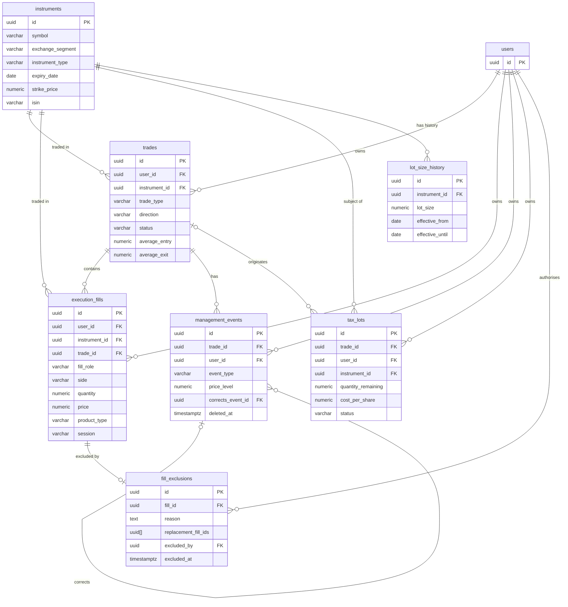

# Trade Domain Data Model

**Status:** Design · Revised  
**Scope:** TradeForge · Phase 1 · Backend  
**Segment:** Indian equity and derivatives — NSE EQ, NSE FO, BSE EQ  
**Binding on:** `TRADE-DOMAIN-RULES.md` · `DECIMAL-USAGE-STANDARD.md` · `ADR-001` · `ADR-002`  
**Author:** Bhima (Backend) · 2026-08-22 · Revised 2026-08-23 · Revised 2026-08-23 (fill_exclusions)  
**Note:** No migrations until design is accepted.

---

## Contents

1. [Overview](#overview)
2. [ER Diagram](#er-diagram)
3. [Table Definitions](#table-definitions)
   - [instruments](#instruments)
   - [lot\_size\_history](#lot_size_history)
   - [trades](#trades)
   - [execution\_fills](#execution_fills)
   - [management\_events](#management_events)
   - [tax\_lots](#tax_lots)
   - [fill\_exclusions](#fill_exclusions)
4. [Index Strategy](#index-strategy)
5. [Persistence Boundaries](#persistence-boundaries)
6. [Deliberately Out of Scope](#deliberately-out-of-scope)

---

## Overview

This design introduces seven new tables. The `users` table already exists from the ADR-002 auth implementation and is referenced here as a foreign key target only. No changes to auth tables.

All monetary amounts, prices, and quantities use `NUMERIC(18,4)` with `asdecimal=True` in SQLAlchemy, per DECIMAL-USAGE-STANDARD.md Rule 7. Charge rates use `NUMERIC(10,8)`. All timestamps are `TIMESTAMPTZ` — IST is UTC+5:30 and all storage is UTC.

| Table | Purpose |
|---|---|
| `instruments` | Master record for every tradeable instrument |
| `lot_size_history` | Dated lot sizes for derivatives (SEBI revises periodically) |
| `trades` | Aggregate trade — one idea, all its fills |
| `execution_fills` | Immutable raw fill from broker or manual entry |
| `management_events` | Stop moves, scale-ins, overnight holds, notes |
| `tax_lots` | FIFO lot tracking for CNC delivery trades |
| `fill_exclusions` | Append-only exclusion list — permanently removes a quarantined E1 fill from reconstruction without modifying `execution_fills` |

---

## ER Diagram



---

## Table Definitions

### `instruments`

Master registry — one row per uniquely identifiable instrument. **Rule 5.1**

| Column | Type | Null | Notes |
|---|---|---|---|
| `id` PK | `UUID` | NOT NULL | Generated via `uuid.uuid4()` |
| `symbol` | `VARCHAR(50)` | NOT NULL | Exchange trading symbol — e.g. `RELIANCE`, `NIFTY` |
| `exchange_segment` | `VARCHAR(20)` | NOT NULL | `NSE_EQ` \| `NSE_FO` \| `BSE_EQ` |
| `instrument_type` | `VARCHAR(10)` | NOT NULL | `EQ` \| `FUT` \| `CE` \| `PE` |
| `expiry_date` | `DATE` | NULL | Derivatives only; NULL for equity |
| `strike_price` | `NUMERIC(18,4)` | NULL | Options only; NULL for equity and futures |
| `isin` | `VARCHAR(12)` | NULL | Equity only. Persists across corporate actions (symbol changes, mergers). Rule 5.1 |
| `name` | `VARCHAR(200)` | NOT NULL | Full descriptive name — e.g. `Reliance Industries Ltd` |
| `created_at` | `TIMESTAMPTZ` | NOT NULL | `DEFAULT now()` |
| `updated_at` | `TIMESTAMPTZ` | NOT NULL | `DEFAULT now()`, updated on every write |

**Constraints & Unique Indexes**

```sql
CHECK exchange_segment IN ('NSE_EQ', 'NSE_FO', 'BSE_EQ')
CHECK instrument_type IN ('EQ', 'FUT', 'CE', 'PE')

-- Equity identity
UNIQUE (symbol, exchange_segment) WHERE instrument_type = 'EQ'

-- Futures identity
UNIQUE (symbol, exchange_segment, expiry_date) WHERE instrument_type = 'FUT'

-- Options identity
UNIQUE (symbol, exchange_segment, expiry_date, strike_price, instrument_type)
    WHERE instrument_type IN ('CE', 'PE')
```

> Three partial unique indexes rather than one composite index with nullable columns — PostgreSQL treats NULLs as distinct in standard unique indexes, which would allow spurious duplicates for equity rows.

---

### `lot_size_history`

Dated lot sizes — SEBI revises derivative lot sizes; historical accuracy requires effective dates. **Rule 5.4**

| Column | Type | Null | Notes |
|---|---|---|---|
| `id` PK | `UUID` | NOT NULL | |
| `instrument_id` FK | `UUID` | NOT NULL | → `instruments(id)`. Must be a derivative instrument. |
| `lot_size` | `NUMERIC(18,4)` | NOT NULL | Minimum tradeable unit quantity. `CHECK lot_size > 0` |
| `effective_from` | `DATE` | NOT NULL | First date this lot size applies. Kubera looks up `effective_from ≤ trade_date` ordered DESC. |
| `effective_until` | `DATE` | NULL | NULL = currently in effect. Set when a newer row supersedes this one. |
| `created_at` | `TIMESTAMPTZ` | NOT NULL | `DEFAULT now()` |

**Constraints**

```sql
UNIQUE (instrument_id, effective_from)
CHECK lot_size > 0
CHECK effective_until IS NULL OR effective_until > effective_from

-- Prevents overlapping effective periods for the same instrument.
-- Requires: CREATE EXTENSION IF NOT EXISTS btree_gist;
-- NULL effective_until is treated as 'infinity' (open-ended, still in effect).
EXCLUDE USING gist (
    instrument_id WITH =,
    daterange(effective_from, COALESCE(effective_until, 'infinity'::date), '[)') WITH &&
)
```

> The EXCLUSION constraint is the authoritative overlap guard. The `UNIQUE (instrument_id, effective_from)` constraint still stands — it catches the simpler duplicate-start-date case without requiring a GiST scan.

---

### `trades`

One row per complete trading idea — stable `trade_id` across all fills and management events. **Rule 1.1, Rule 3.3**

| Column | Type | Null | Notes |
|---|---|---|---|
| `id` PK | `UUID` | NOT NULL | Stable trade_id assigned at first entry fill. Never changes. Rule 1.1 |
| `user_id` FK | `UUID` | NOT NULL | → `users(id)`. RLS filter: every query must include this. |
| `instrument_id` FK | `UUID` | NOT NULL | → `instruments(id)` |
| `trade_type` | `VARCHAR(20)` | NOT NULL | `MIS` \| `CNC` \| `CNC_SAME_DAY` \| `NRML_FUT` \| `NRML_OPT`. Kubera reads this to select the charge schedule. Rule 3.3 |
| `direction` | `VARCHAR(5)` | NOT NULL | `LONG` \| `SHORT` |
| `status` | `VARCHAR(15)` | NOT NULL | `OPEN` \| `PARTIAL` \| `CLOSED`. Maintained during reconstruction. Rule 1.2 |
| `trade_date` | `DATE` | NOT NULL | Calendar date of the first entry fill. Used for FIFO ordering and same-day close detection. Rule 5.2 |
| `first_fill_at` | `TIMESTAMPTZ` | NOT NULL | Timestamp of the first entry fill. |
| `last_fill_at` | `TIMESTAMPTZ` | NULL | Timestamp of the final exit fill. Set when `status = 'CLOSED'`. Rule 1.2 |
| `total_entry_quantity` | `NUMERIC(18,4)` | NOT NULL | Sum of all entry fill quantities. Updated during reconstruction. |
| `total_exit_quantity` | `NUMERIC(18,4)` | NOT NULL | Sum of all exit fill quantities. `DEFAULT 0`. |
| `net_position` | `NUMERIC(18,4)` | NOT NULL | Current open quantity = `total_entry_quantity − total_exit_quantity`. Zero when CLOSED. Rule 1.2 |
| `average_entry` | `NUMERIC(18,4)` | NULL | Weighted average of all entry fills. Computed and stored at 4 dp per DECIMAL-USAGE-STANDARD Rule 7. Rule 2.1 |
| `average_exit` | `NUMERIC(18,4)` | NULL | Weighted average of all exit fills. Set on close. Rule 2.1 |
| `planned_entry` | `NUMERIC(18,4)` | NULL | User-entered intended entry price. Journal field — not used in P&L. |
| `planned_stop` | `NUMERIC(18,4)` | NULL | Intended stop loss price at trade inception. |
| `planned_target` | `NUMERIC(18,4)` | NULL | Intended target price at trade inception. |
| `planned_risk_amount` | `NUMERIC(18,4)` | NULL | Pre-trade risk in INR. Basis for R-multiple once Karna computes it. |
| `setup_name` | `VARCHAR(100)` | NULL | Setup label from user's personal setup library. |
| `notes` | `TEXT` | NULL | Free-form journal notes. |
| `created_at` | `TIMESTAMPTZ` | NOT NULL | `DEFAULT now()` |
| `updated_at` | `TIMESTAMPTZ` | NOT NULL | `DEFAULT now()`, updated on every write |

**Constraints**

```sql
CHECK trade_type IN ('MIS', 'CNC', 'CNC_SAME_DAY', 'NRML_FUT', 'NRML_OPT')
CHECK direction IN ('LONG', 'SHORT')
CHECK status IN ('OPEN', 'PARTIAL', 'CLOSED')
CHECK net_position >= 0
CHECK total_entry_quantity >= 0
CHECK total_exit_quantity >= 0
CHECK total_exit_quantity <= total_entry_quantity
```

> P&L columns (`gross_pnl`, `net_pnl`, charge components) are **not in this table**. Kubera owns that migration.

---

### `execution_fills`

Immutable raw fill record — one row per broker execution event. **Rule 1.1, Rule 3.1, Rule 5.3**

| Column | Type | Null | Notes |
|---|---|---|---|
| `id` PK | `UUID` | NOT NULL | |
| `user_id` FK | `UUID` | NOT NULL | → `users(id)`. Denormalized from trade for RLS enforcement on fills before reconstruction assigns a trade. |
| `instrument_id` FK | `UUID` | NOT NULL | → `instruments(id)` |
| `trade_id` FK | `UUID` | NULL | → `trades(id)`. NULL during import; set once by the reconstruction engine. Never changed after assignment. |
| `fill_role` | `VARCHAR(5)` | NULL | `ENTRY` \| `EXIT`. NULL during import; set once by the reconstruction engine alongside `trade_id`. Derived from `side` relative to `trades.direction` — see Entry/Exit Semantics below. Never changed after assignment. |
| `fill_timestamp` | `TIMESTAMPTZ` | NOT NULL | Exact execution time from broker. Stored as UTC. |
| `trade_date` | `DATE` | NOT NULL | Calendar date of the fill (NSE/BSE trading day). Used by reconstruction for same-day close detection. Rule 5.2 |
| `session` | `VARCHAR(15)` | NOT NULL | `PRE_OPEN` \| `REGULAR` \| `POST_CLOSE`. Computed from `fill_timestamp` during import. Rule 5.3 |
| `side` | `VARCHAR(4)` | NOT NULL | `BUY` \| `SELL`. Raw broker value — immutable after import. |
| `quantity` | `NUMERIC(18,4)` | NOT NULL | Fill quantity. `CHECK quantity > 0` |
| `price` | `NUMERIC(18,4)` | NOT NULL | Actual fill price. `CHECK price > 0` |
| `product_type` | `VARCHAR(10)` | NOT NULL | Raw broker value — `MIS` \| `CNC` \| `NRML`. **Immutable after import.** Never recomputed. Rule 3.1 |
| `exit_type` | `VARCHAR(20)` | NULL | `FORCED` \| `STOP_HIT` \| `TARGET_HIT` \| `DISCRETIONARY` \| `NORMAL`. Applies to EXIT fills only. `FORCED` = broker auto-square. Rule 5.3 |
| `order_id` | `VARCHAR(64)` | NULL | Broker's order ID. Used for reconciliation. |
| `fill_id` | `VARCHAR(64)` | NULL | Broker's execution/fill ID. Null for manual entries. Partial unique index prevents duplicate imports. |
| `broker` | `VARCHAR(20)` | NOT NULL | `ZERODHA` \| `UPSTOX` \| `ANGEL_ONE` \| `MANUAL`. Phase 1 VARCHAR; Phase 2 will FK to `broker_accounts(id)` when KMS credential storage is introduced (ADR-002). |
| `import_source` | `VARCHAR(10)` | NOT NULL | `CSV` \| `API` \| `MANUAL` |
| `created_at` | `TIMESTAMPTZ` | NOT NULL | `DEFAULT now()`. Import timestamp — not the fill time. |

**Constraints**

```sql
CHECK session IN ('PRE_OPEN', 'REGULAR', 'POST_CLOSE')
CHECK side IN ('BUY', 'SELL')
CHECK fill_role IN ('ENTRY', 'EXIT') OR fill_role IS NULL
CHECK product_type IN ('MIS', 'CNC', 'NRML')
CHECK quantity > 0
CHECK price > 0
CHECK broker IN ('ZERODHA', 'UPSTOX', 'ANGEL_ONE', 'MANUAL')

-- fill_role requires trade_id: cannot have a role without a trade assignment
CHECK (trade_id IS NOT NULL OR fill_role IS NULL)

-- exit_type only applies to EXIT fills
CHECK (exit_type IS NULL OR fill_role = 'EXIT' OR fill_role IS NULL)

-- Idempotent re-import protection
UNIQUE (broker, fill_id) WHERE fill_id IS NOT NULL
```

**Immutability policy**

`execution_fills` rows are append-only. A fill is the broker's record of what happened and cannot be corrected retroactively.

Enforced at two layers:

1. **Repository layer** — `FillRepository` exposes only `insert(fill)` and `assign_trade(fill_id, trade_id, fill_role)`. No general-purpose update or delete method exists. `assign_trade` is the only permitted mutation and sets `trade_id` and `fill_role` together in a single atomic write.

2. **Database trigger** — A `BEFORE UPDATE` trigger raises an exception if any column other than `trade_id` and `fill_role` is modified. A `BEFORE DELETE` trigger raises an exception unconditionally. The trigger also raises an exception if `trade_id` or `fill_role` is being changed from a non-NULL value (assignment is one-way: NULL → value, never value → different value).

There is no correction mechanism for ordinary import errors. If a fill was imported incorrectly, the import batch must be voided (a future operational capability, not in this design) and the fills re-imported.

**E1 crossing-zero exception — `fill_exclusions`:** a fill that triggers a position-crossing-zero error (E1) is permanently excluded from reconstruction by inserting a row into the `fill_exclusions` side-table. The `execution_fills` row is never modified. The exclusion is recorded externally; the original fill remains intact as audit evidence. The engine filters excluded fills before processing (see `fill_exclusions` section and `TRADE-RECONSTRUCTION-SPEC.md §12`).

**Entry/Exit Semantics by Direction**

`fill_role` is derived by the reconstruction engine from `side` and the parent trade's `direction`. The mapping is deterministic:

| Trade `direction` | Fill `side` | `fill_role` |
|---|---|---|
| `LONG` | `BUY` | `ENTRY` |
| `LONG` | `SELL` | `EXIT` |
| `SHORT` | `SELL` | `ENTRY` |
| `SHORT` | `BUY` | `EXIT` |

This mapping is enforced by the reconstruction engine at the time it assigns `trade_id` and `fill_role`. No fill may be assigned a `fill_role` inconsistent with this table. The reconstruction engine raises a domain error if a fill's `side` produces no valid role for the assigned trade's `direction`.

`total_entry_quantity`, `total_exit_quantity`, `average_entry`, and `average_exit` on the parent `trades` row are computed exclusively from fills with `fill_role = 'ENTRY'` and `fill_role = 'EXIT'` respectively.

---

### `management_events`

Deliberate management actions taken during an open trade — the journal's per-decision audit trail. **Rule 1.1**

| Column | Type | Null | Notes |
|---|---|---|---|
| `id` PK | `UUID` | NOT NULL | |
| `trade_id` FK | `UUID` | NOT NULL | → `trades(id)` |
| `user_id` FK | `UUID` | NOT NULL | → `users(id)`. Denormalized for direct RLS enforcement. |
| `event_type` | `VARCHAR(30)` | NOT NULL | See CHECK constraint below. Enum is extensible — bring new types to Ganesha before adding. |
| `occurred_at` | `TIMESTAMPTZ` | NOT NULL | When the management action occurred (user-entered or inferred). |
| `price_level` | `NUMERIC(18,4)` | NULL | New stop price, new target price, or breakeven level depending on event type. |
| `quantity` | `NUMERIC(18,4)` | NULL | Applicable for `SCALE_IN` and `DEFENSIVE_SCALE_OUT` event types. |
| `notes` | `TEXT` | NULL | Reason for the management action. |
| `corrects_event_id` FK | `UUID` | NULL | → `management_events(id)`. When set, this row is a correction of the referenced event. The corrected event is retained (audit trail); queries must filter `deleted_at IS NULL` and exclude events that are the target of a correction event. |
| `deleted_at` | `TIMESTAMPTZ` | NULL | NULL = active. Set to `now()` on soft delete. Rows are never hard-deleted. |
| `created_at` | `TIMESTAMPTZ` | NOT NULL | `DEFAULT now()` |

**Constraints**

```sql
CHECK event_type IN (
    'STOP_MOVED_BREAKEVEN',
    'STOP_TIGHTENED',
    'STOP_WIDENED',
    'TARGET_ADJUSTED',
    'SCALE_IN',
    'DEFENSIVE_SCALE_OUT',
    'OVERNIGHT_HOLD_NOTED',
    'NOTE_ADDED'
)

-- A correction event must belong to the same trade as the event it corrects
-- (enforced at application layer; cannot be expressed as a simple CHECK)
```

> This list is a starting set. Additions require Ganesha review — event semantics affect analytics attribution.

**Immutability and correction policy**

Body fields (`event_type`, `occurred_at`, `price_level`, `quantity`, `notes`) are immutable after INSERT. The only permitted mutations are:

- **Soft delete** — set `deleted_at = now()`. The row is retained permanently for audit trail purposes. `ManagementEventRepository` exposes `soft_delete(event_id)` only; no hard-delete method exists.
- **Correction** — create a new event with `corrects_event_id` pointing to the superseded row. Both the original and the correction are retained. The superseded event is identified by joining on `corrects_event_id` and is excluded from the active event timeline.

Enforced at two layers:

1. **Repository layer** — `ManagementEventRepository` exposes `insert(event)` and `soft_delete(event_id)` only. No UPDATE method on body fields exists.

2. **Database trigger** — A `BEFORE UPDATE` trigger raises an exception if any column other than `deleted_at` is modified after INSERT.

Active event timeline query canonical form:

```sql
-- All active, non-superseded events for a trade, ordered chronologically
SELECT me.*
FROM management_events me
WHERE me.trade_id = $1
  AND me.deleted_at IS NULL
  AND NOT EXISTS (
      SELECT 1 FROM management_events correction
      WHERE correction.corrects_event_id = me.id
        AND correction.deleted_at IS NULL
  )
ORDER BY me.occurred_at ASC
```

---

### `tax_lots`

FIFO lot tracking for CNC delivery trades — one row per originating trade, decremented on each exit. **Rule 4.1, Rule 4.3**

| Column | Type | Null | Notes |
|---|---|---|---|
| `id` PK | `UUID` | NOT NULL | |
| `trade_id` FK | `UUID` | NOT NULL | → `trades(id)`. The originating CNC purchase trade. UNIQUE — one tax lot per trade. Rule 4.3 |
| `user_id` FK | `UUID` | NOT NULL | → `users(id)`. Required in the FIFO query WHERE clause. |
| `instrument_id` FK | `UUID` | NOT NULL | → `instruments(id)`. Denormalized from trade — FIFO query must filter on this without joining trades. |
| `purchase_date` | `DATE` | NOT NULL | Equals `trades.trade_date` of the originating trade. FIFO ORDER BY sorts on this. Rule 4.3 |
| `quantity_original` | `NUMERIC(18,4)` | NOT NULL | Total quantity when lot was created. Immutable after creation. |
| `quantity_remaining` | `NUMERIC(18,4)` | NOT NULL | Decremented on each exit fill allocated against this lot. Equals `quantity_original` at creation. Rule 4.3 |
| `cost_per_share` | `NUMERIC(18,4)` | NOT NULL | Equals `trades.average_entry` at the time of lot creation. Immutable after creation. Rule 4.3 |
| `status` | `VARCHAR(20)` | NOT NULL | `OPEN` \| `PARTIALLY_CLOSED` \| `CLOSED`. Rule 4.3 |
| `created_at` | `TIMESTAMPTZ` | NOT NULL | `DEFAULT now()` |
| `updated_at` | `TIMESTAMPTZ` | NOT NULL | `DEFAULT now()` |

**Constraints**

```sql
UNIQUE (trade_id)  -- one tax lot per CNC originating trade
CHECK status IN ('OPEN', 'PARTIALLY_CLOSED', 'CLOSED')
CHECK quantity_remaining >= 0
CHECK quantity_remaining <= quantity_original
CHECK quantity_original > 0
CHECK cost_per_share > 0
```

**FIFO query canonical form:**

```sql
WHERE user_id = $1
  AND instrument_id = $2
  AND status != 'CLOSED'
ORDER BY purchase_date ASC
```

---

### `fill_exclusions`

Append-only exclusion list — permanently removes a quarantined E1 crossing-zero fill from all future reconstruction runs without modifying the original `execution_fills` row. One row per excluded fill. See `TRADE-RECONSTRUCTION-SPEC.md §12 (E1)` for the complete operator workflow.

| Column | Type | Null | Notes |
|---|---|---|---|
| `id` PK | `UUID` | NOT NULL | Generated via `uuid.uuid4()` |
| `fill_id` FK | `UUID` | NOT NULL | → `execution_fills(id)`. UNIQUE — one exclusion record per fill. The referenced fill is never modified. |
| `reason` | `TEXT` | NOT NULL | Human-readable explanation. Must identify which replacement fills supersede this one (e.g., "E1 crossing-zero — replaced by MANUAL fills {uuid_a} and {uuid_b}"). |
| `replacement_fill_ids` | `UUID[]` | NOT NULL | Array of `execution_fills.id` values for the `import_source = 'MANUAL'` fills that replace the excluded fill. Empty array (`'{}'`) is permitted if no replacements have been created yet, but the operator workflow in §12 requires replacements to exist before triggering reconstruction. |
| `excluded_by` | `UUID` | NOT NULL | → `users(id)`. The operator (acting as an authenticated user) who created the exclusion. |
| `excluded_at` | `TIMESTAMPTZ` | NOT NULL | `DEFAULT now()`. When the exclusion was recorded. |

**Constraints**

```sql
UNIQUE (fill_id)   -- one exclusion record per fill; critical correctness constraint
```

**Append-only policy**

`fill_exclusions` rows are permanent — once inserted, they are never updated or deleted. The exclusion is an immutable audit record that the fill was permanently removed from reconstruction and why.

Enforced at two layers:

1. **Repository layer** — `FillExclusionRepository` exposes only `insert(exclusion)` and `exists_by_fill_id(fill_id)`. No update or delete method exists.

2. **Database trigger** — A `BEFORE UPDATE` trigger raises an exception unconditionally. A `BEFORE DELETE` trigger raises an exception unconditionally.

**Engine interaction**

The reconstruction engine filters excluded fills at the point of querying unprocessed fills (see `TRADE-RECONSTRUCTION-SPEC.md §2`):

```sql
SELECT * FROM execution_fills
WHERE trade_id IS NULL
  AND id NOT IN (SELECT fill_id FROM fill_exclusions)
ORDER BY fill_timestamp ASC
```

The excluded fill's `trade_id` remains NULL permanently. No trade record is ever created for it.

---

## Index Strategy

All FK columns get an index. Additional indexes cover the access patterns required by the journal, FIFO query, and reconstruction engine.

| Table | Index | Columns / Condition | Purpose |
|---|---|---|---|
| `instruments` | PK | `id` | Primary key |
| `instruments` | PARTIAL UNIQUE | `(symbol, exchange_segment) WHERE instrument_type = 'EQ'` | Equity identity — Rule 5.1 |
| `instruments` | PARTIAL UNIQUE | `(symbol, exchange_segment, expiry_date) WHERE instrument_type = 'FUT'` | Futures identity — Rule 5.1 |
| `instruments` | PARTIAL UNIQUE | `(symbol, exchange_segment, expiry_date, strike_price, instrument_type) WHERE instrument_type IN ('CE','PE')` | Options identity — Rule 5.1 |
| `instruments` | `idx_instruments_isin` | `isin WHERE isin IS NOT NULL` | ISIN lookup for corporate action handling |
| `lot_size_history` | PK | `id` | Primary key |
| `lot_size_history` | UNIQUE | `(instrument_id, effective_from)` | One entry per instrument per date |
| `lot_size_history` | `idx_lsh_instrument_until` | `(instrument_id, effective_until)` | Look up current lot size: `WHERE effective_until IS NULL` |
| `trades` | PK | `id` | Primary key |
| `trades` | `idx_trades_user_status` | `(user_id, status)` | Open positions dashboard — primary access pattern |
| `trades` | `idx_trades_user_date` | `(user_id, trade_date DESC)` | Journal chronological listing |
| `trades` | `idx_trades_user_instrument_status` | `(user_id, instrument_id, status)` | Open position by instrument |
| `trades` | `idx_trades_instrument_id` | `instrument_id` | FK index |
| `execution_fills` | PK | `id` | Primary key |
| `execution_fills` | `idx_fills_trade_id` | `trade_id` | All fills for a trade — core reconstruction and display query |
| `execution_fills` | `idx_fills_user_instrument_date` | `(user_id, instrument_id, trade_date)` | Reconstruction: find all fills for an instrument on a date |
| `execution_fills` | `idx_fills_user_date` | `(user_id, trade_date DESC)` | Import history view |
| `execution_fills` | PARTIAL UNIQUE | `(broker, fill_id) WHERE fill_id IS NOT NULL` | Idempotent re-import |
| `management_events` | PK | `id` | Primary key |
| `management_events` | `idx_mgmt_trade_id` | `trade_id` | All events for a trade — FK index and primary access |
| `management_events` | `idx_mgmt_user_occurred` | `(user_id, occurred_at DESC)` | User activity audit trail |
| `management_events` | `idx_mgmt_corrects_event_id` | `corrects_event_id WHERE corrects_event_id IS NOT NULL` | FK index; also used in the active-timeline EXISTS subquery |
| `tax_lots` | PK | `id` | Primary key |
| `tax_lots` | UNIQUE | `trade_id` | One lot per CNC trade |
| `tax_lots` | `idx_taxlots_fifo` | `(user_id, instrument_id, status, purchase_date)` | FIFO allocation query — order is critical |
| `fill_exclusions` | PK | `id` | Primary key |
| `fill_exclusions` | UNIQUE | `fill_id` | One exclusion per fill; also serves as FK index |
| `fill_exclusions` | `idx_fill_exclusions_excluded_by` | `excluded_by` | FK index on users |

---

## Persistence Boundaries

Per ADR-001, SQLAlchemy models live in the infrastructure layer only. The domain layer contains no ORM imports. The application layer orchestrates; the domain layer calculates.

| Layer | Contents |
|---|---|
| **Domain Layer** | `Trade` dataclass · `ExecutionFill` dataclass · `TaxLot` dataclass · `FillExclusion` dataclass · `decimal_config.py` · No external imports |
| **Infrastructure Layer** | `Instrument` ORM model · `LotSizeHistory` ORM model · `Trade` ORM model · `ExecutionFill` ORM model · `ManagementEvent` ORM model · `TaxLot` ORM model · `FillExclusion` ORM model |
| **Repositories** | `InstrumentRepository` · `TradeRepository` · `FillRepository` · `TaxLotRepository` · `FillExclusionRepository` |
| **Alembic Migrations** | One migration file per logical change · Forward-only · Expand-contract for column changes · P&L columns in separate Kubera migration |

---

## Deliberately Out of Scope

The following columns, tables, and features are absent from this design. Each is excluded for a specific reason — unresolved domain question, different domain owner, or a later phase. They must not be added speculatively.

> **Not a gap — a boundary.** Items excluded because they belong to another domain owner will be introduced by that owner's migration. Items excluded because the domain question is unresolved will be added once Ganesha resolves them. Do not add them here without a resolved rule.

| Item | Reason | Owner |
|---|---|---|
| `gross_pnl`, `net_pnl` | P&L formula requires charge schedule tables that don't exist yet. | Kubera |
| Charge columns (`stt`, `brokerage`, `exchange_charge`, `sebi_charge`, `gst`, `stamp_duty`) | Kubera owns charge calculation and the column definitions that result. | Kubera |
| `charge_rates` / `charge_schedules` table | Rates are dated attributes stored per broker per trade type. | Kubera |
| `r_multiple` | Computed by Karna from closed trade data and `planned_risk_amount`. Not stored in this migration. | Karna |
| F&O expiry handling | `exit_type = EXPIRY_WORTHLESS`, settlement price fill synthesis — Unresolved 1. Sanjaya and Bhima blocked. | Unresolved 1 |
| Options exercise / assignment | Transition from options trade to underlying equity position. Cost basis treatment unresolved. | Unresolved 2 |
| Corporate action events table | Split / bonus adjustments to open tax lots. Historical cost basis retroactive update logic unresolved. | Unresolved 3 |
| Multi-day partial exit attribution | How per-day P&L is attributed when a delivery trade has partial exits on different dates. | Unresolved 4 |
| F&O tax lot extensions | Whether FIFO applies to multi-day NRML_FUT position builds. | Unresolved 5 |
| `broker_accounts` table | KMS-encrypted broker credentials. Phase 2 per ADR-002. `execution_fills.broker` stays VARCHAR until then. | Phase 2 / ADR-002 |
